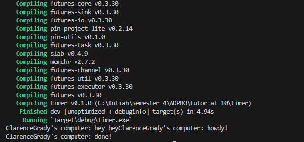
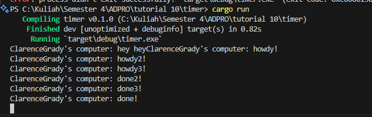

The main function creates an executor for running tasks and a spawner for creating new tasks. It then spawns an asynchronous task to print ClarenceGrady's computer: howdy!”, wait for 2 seconds, and print “ClarenceGrady's computer: done!”. However, this task doesn’t block the main function, which continues to print “ClarenceGrady's computer: hey hey” before the asynchronous task has a chance to run. Once all tasks are spawned and the spawner is dropped, the executor runs until all tasks are complete, allowing the asynchronous task to execute. Therefore, “ClarenceGrady's computer: hey hey” is printed before “ClarenceGrady's computer: howdy!” and “ClarenceGrady's computer: done!” because the main function doesn’t wait for the asynchronous task to complete.

The drop(spawner) line is used to indicate that no more tasks will be spawned. This is important for the executor to know when it can stop running. The executor is responsible for running all the tasks that have been spawned. If the spawner isn't dropped, the executor might wait indefinitely for more tasks to be spawned. By dropping the spawner, you're ensuring that the executor knows when it can finish and allow the tasks to complete.